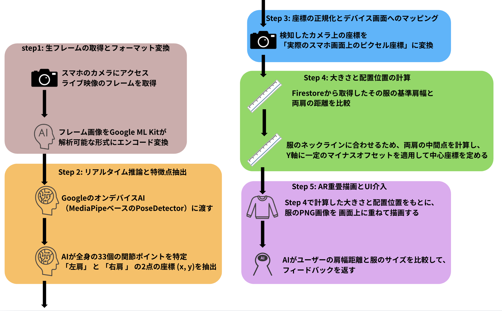

# AnyWear (by Team: ファイヤーマンジャケット)

[](https://flutter.dev/)
[](https://dart.dev/)
[](https://firebase.google.com/)
[](https://cloud.google.com/)
[](https://ai.google.dev/)
[](https://developers.google.com/mediapipe)
[](https://developer.apple.com/ios/)
[](https://developer.android.com/)

> **テーマ "Brand New Hello World." の解釈**
> <br>
> プログラミングの世界への第一歩である「Hello World」。私たちはこの概念をアパレル業界に持ち込みました。スマートフォン一つで、いつでもどこでも服を試着できる世界。
> **「AnyWear（エニウェア）」** は、試着のために店舗へ行くこれまでの常識を覆し、アパレルECにおける **「アパレル業界の新しい第一歩」** を定義します。

---

## デモ動画

### iOS デモンストレーション

[](https://youtube.com/shorts/t49QwF64mrw)

### Android デモンストレーション

[](https://youtube.com/shorts/lzUw3L7s9uI)

> ※画像をクリックするとYouTube動画(Shorts)が再生されます。

---

## 解決する社会的課題

現在のオンラインショッピングには、消費者が超えられない **「試着の壁」** が存在します。

- 「オンライン限定の服、自分に合うサイズ感が分からない…」
- 「試着せずに買ったらサイズが合わず、結局返品してしまった」

これにより、ユーザー体験が損なわれるだけでなく、EC事業者にとっても **「返品によるコストの増加」** が課題となっています。
`AnyWear` は、スマートフォン向けAR技術によるリアルタイムな仮想試着を提供し、この課題を根本から解決します。

## コア体験・機能

本ハッカソンでは、「スマートフォン実機で滑らかに動く、新しい体験」にフォーカスして開発しました。

1. **リアルタイムAR仮想試着機能**
   <br>
   スマートフォンのフロントカメラ映像から、Google MediaPipeを用いてユーザーの骨格（肩・腰などの特徴点）をリアルタイムに検知。数学的な座標変換（アスペクト比の補正等）を行い、2Dの服画像をユーザーの動きにピタリと追従させて重畳表示します。
2. **ワンタップ・サイズ切り替え**
   <br>
   画面下の「S, M, L, XL」ボタンをタップすると、動的スケール計算によりAR上の服が瞬時に拡大縮小。「着丈が長すぎる」「肩幅がタイト」といったサイズ感の違いを、視覚的かつ即座に確認できます。
3. **AI サイズアドバイス**
   <br>
   推論された利用者の体型データと現在試着中のサイズをもとに、Gemini APIを用いて「Mサイズだと少し袖が長そうですね」といった、販売員のようなパーソナライズされたリアルタイムフィードバックを提供します。

## アーキテクチャと技術スタック



単なるライブラリの組み合わせではなく、数学的アプローチによる空間的なAR試着処理を独自に実装しています。

- **フロントエンド:** `Flutter` (iOS/AndroidクロスプラットフォームでのUI描画)
- **AI / コンピュータービジョン:** `MediaPipe Pose Detection` (オンデバイスでの姿勢・骨格推定の実装)
- **バックエンド / DB:** `Firebase` (Firestore / Auth)を用いたリアルタイムなデータ同期
- **生成AI / エージェント:** `Gemini API` MediaPipeから得られた骨格比率やポーズデータをもとに、リアルタイムな着用感のパーソナルアドバイス（例：「ちょうど良いサイズですね」、「袖が少し長そうです」等）を自動生成。

## 動作環境とセットアップ (How to Run)

_(※カメラ機能とリアルタイム推論を使用するため、実機でのテストを強く推奨します)_

```bash
# 1. リポジトリのクローン
git clone https://github.com/YOUR_GITHUB_ORG/gdgoc_hackathon_2026.git
cd gdgoc_hackathon_2026

# 2. パッケージのインストール
flutter pub get

# 3. 環境変数の設定 (Gemini APIの利用)
# プロジェクトルートに `.env` ファイルを作成し、ご自身のAPIキーを記載してください
echo "GEMINI_API_KEY=your_gemini_api_key_here" > .env

# 4. アプリの起動 (iOS実機 または Android実機を接続した状態で実行)
flutter run
```

## 未来の展望 (Future Vision)

現在のMVPをベースに、私たちは以下の「理想のプロダクト」への進化を目指しています。

1. **AIエージェントのさらなる高度化 (ADK等の活用)**
   現在実装している基盤をさらに発展させ、「しゃがむと少し太ももがキツイですね、Lサイズを取り寄せましょうか？」など、ユーザーの細かい動きの解析や音声での対話を通じ、より高度で自律的に提案・調整を行うAIエージェントへの拡張。
2. **Body Passport (分散型体型ID)**
   一度取得した正確な骨格データを安全に保存し、どのECサイトでもワンタップで最適サイズが購入できる社会インフラとしての実装。
